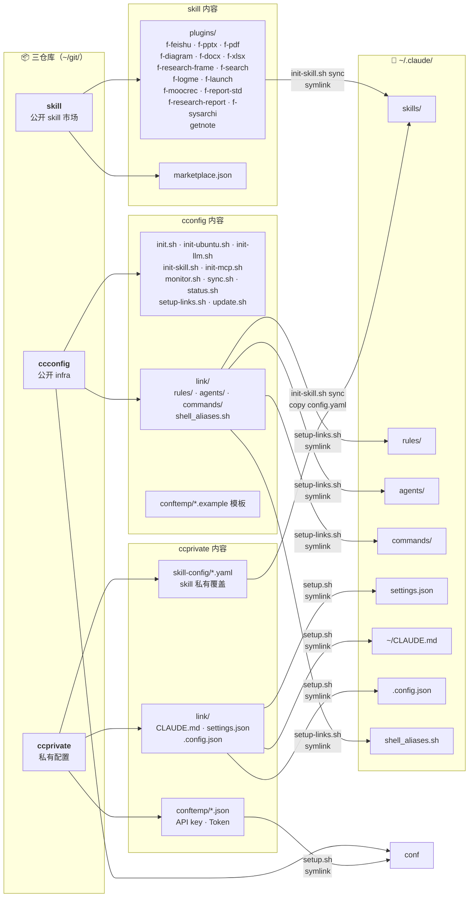

# ccconfig — Claude Code 配置中枢

> 统一管理 Claude Code 配置。三仓库公私分离。一键恢复到新终端。

## 概述

ccconfig 是 Claude Code 配置基础设施的公开部分。**三仓库模型**各司其职：

| 仓库 | 可见性 | 内容 |
|------|--------|------|
| **ccconfig** | 公开 | infra 脚本（init/bootstrap/sync/monitor）、rules、agents、commands |
| **[skill](https://github.com/mengfanchun2017/skill)** | 公开 | Skill 插件市场（Anthropic marketplace 兼容），15 个自建 f-* skill |
| **ccprivate** | 私有 | API key / Token / 个人配置，通过 symlink 穿透访问 |

ccconfig 本身不含任何密钥，可安全公开。Skill 插件独立发布为 skill 仓库，符合 Anthropic marketplace 规范，可被任何 Claude Code 用户 `/plugin marketplace add` 安装。

- **环境**：Ubuntu/WSL 一键初始化
- **配置**：LLM 后端、MCP 服务器、API key 单一真相源（真实值在 ccprivate）
- **同步**：文件监听 + 自动 git commit/push，覆盖 `~/git/` 下所有仓库
- **Skills**：15 自建（symlink）+ 第三方 npx skills 自管（conf 清单）
- **Rules**：条件规则按路径加载（编码、git、python、搜索、飞书、godot）
- **Agents**：意图路由 agent
- **可选**：飞书 Bridge、OfficeCLI、PPT 生成、远程 SSH

## Why ccconfig?

Claude Code 配置分散在 `~/.claude/`、环境变量、MCP 服务器、skills 等多处。换机器或重装系统后需要数小时重新配置。ccconfig 解决三件事：

1. **统一管理** — 所有配置集中到 git 仓库，版本可控
2. **一键恢复** — 新终端 10 分钟从零到全功能（BOOTSTRAP 8 阶段）
3. **多设备同步** — auto-sync 守护进程自动 commit+push，多机配置一致

三仓库分工明确：ccconfig 管 infra、skill 管 skill 插件、ccprivate 管密钥。ccconfig 用户一键获得全部能力；skill 可独立使用（不需 ccconfig）。

> 适合：Claude Code 重度用户 / 多机器工作 / 想统一团队 Claude Code 配置的 TL

## 架构



> **密钥隔离**：`conf/*.json`（llm/claude/feishu/f-logme/f-feishu/f-pptx/cloudflare/supabase/ubuntu）是 ccprivate→ccconfig 的 symlink，`.gitignore` 已忽略。公开仓库只含 `.example` 模板。详见 [BOOTSTRAP.md](BOOTSTRAP.md)。

## 特色亮点

ccconfig 不只是符号链接集合。以下是你真正用到的能力：

### 🔀 LLM 后端随心切

```bash
bash lib/init-llm.sh              # 交互菜单
bash lib/init-llm.sh deepseek     # 一条命令切
```

- **多预设管理** — 内置 MiniMax/DeepSeek/Gateway，支持自建自定义预设（OpenRouter、自部署网关等），菜单操作增删查切
- **Custom 临时模式** — 输入任意 Anthropic-compatible 端点 URL 即刻切换，不写配置；需要时可保存为永久预设
- **Gateway 自动切换** — 安装 `option-llmswitch` 后，LLM 代理网关按高峰/非高峰时段自动切后端（如高峰 DeepSeek → MiniMax），Claude Code 不重启
- **OpenAI Bridge** — 遇到 OpenAI-only 端点（无 `/anthropic` 路由），自动启动 Anthropic↔OpenAI 协议转换 proxy，零感知
- **Key 智能来源** — 切换时自动复用已有配置中的 API key，不需反复粘贴
- **Prompt Cache 1h** — 环境变量 `ENABLE_PROMPT_CACHING_1H=1` 自动注入，闲置回来不重算前缀，恢复更快

> 最近新增：Delete 删除预设（三道守卫防误删）、Gateway 配置交互式向导（模式/高峰时段/路由名/手动 provider 过滤）、路由名编号菜单、`start-openai-bridge.sh` 一键启动

### 🧩 Skills 即插即用

- **双通道 skill 源** — 自建 skill (git symlink) + 第三方 skill (npx 安装)，`lib/init-skill.sh sync` 统一管理
- **漂移检测** — 自动清理断链、孤儿 skill 残留、marketplace 遗留
- **配置叠加** — 私有 skill 配置 (ccprivate/config/*.yaml) 自动覆盖公开模板，sync 时合并
- **独立可用** — Skills 市场独立于 ccconfig，任何 Claude Code 用户可 `/plugin marketplace add` 安装

### 🔐 公开/私密分离（三仓库模型）

| 仓库 | 存什么 | 可公开？ |
|------|--------|---------|
| ccconfig | 脚本、rules、agents、commands、.example 模板 | ✅ 开源可 fork |
| skill | 15 个 f-* skill 插件 | ✅ marketplace 规范 |
| ccprivate | API key、token、个人 CLAUDE.md/settings.json | ❌ 私有 |

符号链接桥接三仓库。公开仓库零 token。`pre-commit` hook 自动拦截私密文件提交。

### 🔄 Auto-Sync 守护进程

systemd 文件监听 (`inotify`) + 60 秒 debounce，`~/git/` 下所有仓库自动 commit + push。多机配置始终一致。

- 智能冲突处理 — pull 代理超时优化、冲突解决公共库 (`lib/git-conflict.sh`)
- 运行状态一目了然 — `maintain.sh status` 检查 12 项状态，含 GitHub 最后推送时间

### 🚀 新机器 10 分钟上线

```bash
curl -fsSL https://raw.githubusercontent.com/mengfanchun2017/ccconfig/main/bootstrap.sh | bash
```

一行命令走完 8 阶段：装 gh → 登录 GitHub → 克隆 ccconfig → 创建 ccprivate → Ubuntu 环境 → LLM 配置 → MCP 注册 → Skills 同步。详见 [BOOTSTRAP.md](BOOTSTRAP.md)。

### 🧪 完整测试套件

```bash
bash tests/test-init.sh            # 45 个用例，mock 隔离，秒级完成
bash tests/test-init.sh --verbose  # 详细输出
```

覆盖 ensure_config / ensure_claude_skills / 首次检测 / placeholder 识别 / `$HOME` 展开 / `init --dry-run` / sync 容错 / MCP 路径修正。改完脚本跑一遍验证不引入回归。

### 📌 版本锁定

`conftemp/versions.json` 单一真相源锁定每个工具版本 — Node、gh、Claude Code CLI、lark-cli、Python uv、第三方 skill 版本。`update.sh all` 按版本清单升级，不会意外炸掉。

### 🛠 统一运维入口

```bash
bash maintain.sh [status|monitor|sync|update|deps|fix]
```

- `status` — 12 项全量检查（链接/依赖/守护进程/Git 推送/MCP 健康/Skills/可选组件）
- `fix` — 自动修复断链、重建符号链接
- `deps` — 依赖完整性检查（Node/uv/gh/lark-cli 等）
- `monitor` — 启动/停止/查看 auto-sync 守护进程

### 🔌 可选组件生态

| 组件 | 一句话 | 安装 |
|------|--------|------|
| `option-llmswitch` | LLM 网关代理，按时段自动切后端 | `bash option-llmswitch/init.sh` |
| `option-bridge` | 飞书消息 Bridge + 多机器人 | `bash option-bridge/init.sh` |
| `option-officecli` | AI-native Office 工具（PPT/docx/xlsx 生成） | `bash option-officecli/init.sh` |
| `option-cloudflare` | Cloudflare Workers/R2/D1/Pages 开发环境 | `bash option-cloudflare/init.sh` |
| `option-remote` | Tailscale + SSH 远程连接桌面 tmux session | 见 `option-remote/readme.md` |
| `windows-tools` | WSL/Windows 互操作工具（音乐转换、PS 更新） | — |

每个组件 `init.sh` 均支持 `--status`，自动被 `status.sh` 发现。

## 目录结构

```
ccconfig/
├── bootstrap.sh              # Step 2: 装 gh + GitHub 认证
├── init.sh                   # 入口（交互式二级菜单 + 一键全部）
├── maintain.sh               # 统一运维入口（status/monitor/sync/update/deps/fix）
│
├── conftemp/                 # 配置模板 + symlink → ccprivate/conf/
│   ├── *.json.example        # 公开模板（可提交）
│   ├── *.json                # → symlink 到 ccprivate/conf/（不跟踪）
│   ├── versions.json         # 组件版本（公开）
│   ├── third-party-skills.txt # 第三方 npx skill 清单
│   └── python-requirements.txt
│
├── lib/                      # 脚本库 + 子脚本
│   ├── init-ubuntu.sh        # Ubuntu/WSL 全环境初始化
│   ├── init-llm.sh           # LLM 后端切换
│   ├── init-mcp.sh           # MCP 服务器管理
│   ├── init-skill.sh         # Skills 同步管理
│   ├── init-autostart.sh     # auto-sync systemd 服务
│   ├── start-openai-bridge.sh # OpenAI-only 端点协议桥
│   ├── monitor.sh            # 多仓库文件监听 + 自动 git 同步
│   ├── status.sh             # 状态检查（12 项）
│   ├── sync.sh               # 多仓库智能同步（云端↔本地）
│   ├── update.sh             # 月度组件升级
│   ├── setup-links.sh        # 公开部分符号链接
│   ├── deps-check.sh         # 依赖完整性检查
│   ├── path-helper.sh        # 动态路径解析 + CCCONFIG_HOME
│   ├── git-conflict.sh       # Git 冲突解决公共库
│   └── colors.sh             # 终端颜色定义
│
├── link/                     # → ~/.claude/ 符号链接源（公开部分）
│   ├── rules/                # 条件规则（9 个）
│   ├── agents/               # 意图路由 agent
│   ├── commands/             # 自定义斜杠命令
│   ├── skills/               # skill 配置（README 占位）
│   ├── shell_aliases.sh      # 跨终端 shell 别名同步
│   ├── settings.json.example # settings 公开模板
│   └── projects/             # → symlink 到 ccprivate/link/projects/
│
├── hooks/
│   ├── pre-commit            # git hook：防私密文件意外提交
│   ├── session-end-aggregator.sh  # Claude hook：自动 worklog
│   └── session_end_aggregator.py # worklog 聚合逻辑
│
├── bin/
│   ├── init-ccprivate.sh     # 交互式引导：收集信息 → 创建 ccprivate 仓库
│   └── memory-check.sh       # MEMORY.md 过期/孤立条目检测
│
├── scripts/                  # 内部/自动化脚本
│   ├── merge_worklog.py      # worklog 合并
│   ├── publish.sh            # 发布辅助
│   └── update-third-party-skills.sh  # 第三方 skill 更新
│
├── docs/                     # 设计文档
│   ├── architecture.md       # 架构设计
│   ├── prd.md                # 产品需求文档
│   ├── adr/                  # 架构决策记录
│   ├── plans/                # 实现计划
│   └── figs/                 # 图表素材
│
├── option-bridge/            # 可选：飞书消息 Bridge
├── option-officecli/         # 可选：OfficeCLI
├── option-llmswitch/         # 可选：LLM 网关代理
│
├── option-remote/                   # 远程访问（Tailscale + SSH + tmux）
├── windows-tools/            # Windows/WSL 互操作
│
├── .github/                  # CI/CD
│   └── workflows/            # check.yml, secrets-scan.yml
│
├── www/                      # Cloudflare Pages 站点
│
├── LICENSE                   # MIT
├── BOOTSTRAP.md              # 新机器 0→1 拉起指南
├── CHANGELOG.md              # 变更历史
├── ROADMAP.md                # 路线图
├── SECURITY.md               # 安全策略
└── CONTRIBUTING.md           # 贡献指南
```

## 快速开始

> **新机器？** 从零开始 → 看 [BOOTSTRAP.md](BOOTSTRAP.md)（8 阶段，含 gh 登录 + 克隆 ccconfig + ccprivate）。

> **main 即稳定版**：直接 clone 默认分支，`git pull` 更新。需要钉版本时 `git checkout <tag>`。

```bash
# 1. Fork + Clone（SSH 推荐，HTTPS 备选）
git clone git@github.com:<your-github-username>/ccconfig.git ~/git/ccconfig

# 2. 装 gh CLI + GitHub 认证（已有 gh 可跳过）
bash ~/git/ccconfig/bootstrap.sh

# 3. 创建 ccprivate 私有配置仓库
bash ~/git/ccconfig/bin/init-ccprivate.sh

# 4. 全量初始化（Ubuntu → LLM → MCP → Skills → 验证）
bash ~/git/ccconfig/init.sh all

# 5. 状态检查
bash ~/git/ccconfig/status.sh
```

> **gh 已装？** 跳过步骤 2。`init-ccprivate.sh` 内部也会检测 gh 并引导安装。
> **已有 ccprivate？** `bash ~/git/ccconfig/bin/init-ccprivate.sh --clone` 从 GitHub 克隆。
> **不改系统？** `bash ~/git/ccconfig/init.sh` 进入交互式菜单，按需选择。

## 核心命令

| 命令 | 用途 |
|------|------|
| `bash bootstrap.sh` | 装 gh CLI + GitHub 认证 |
| `bash bin/init-ccprivate.sh` | 创建/克隆 ccprivate |
| `bash init.sh` | 交互式菜单 |
| `bash init.sh all` | 一键全初始化 |
| `bash lib/status.sh` | 完整状态检查（12 项） |
| `bash lib/deps-check.sh` | 依赖完整性检查 |
| `bash lib/update.sh all` | 月度组件升级 |
| `bash lib/monitor.sh start` | 启动 auto-sync |
| `bash lib/monitor.sh status` | 同步守护进程状态 |
| `bash lib/setup-links.sh` | 重建公开符号链接 |
| `bash lib/sync.sh --pull` | 强拉远程 |

## 日常维护

ccconfig 本身是一个 git 仓库，更新方式：

```bash
# 方式 1：update.sh 会自动先 git pull ccconfig（推荐）
bash update.sh all

# 方式 2：手动 git pull
cd ~/git/ccconfig && git pull
```

`update.sh all` 推荐每月跑一次，升级 Node.js、Claude Code、Python 包等组件。ccconfig 自身会先 `git pull` 确保脚本最新。

> auto-sync monitor 只自动 push，不自动 pull。ccconfig 更新需手动拉取。

## 状态检查覆盖

`status.sh` 每次 Claude Code session 启动检查 12 项：

1. 配置文件链接（settings.json、.config.json、CLAUDE.md、MEMORY.md、rules）
2. 核心依赖（git、bash、curl）
3. auto-sync 守护进程
4. GitHub 最后推送
5. MEMORY 最后更新
6. Git 项目状态
7. 飞书 lark-cli 状态
8. Playwright 浏览器测试
9. MCP 服务器健康检查（并行，24h 缓存）
10. 远程访问（SSH、Tailscale）
11. option-* 可选组件自动发现
12. Skills 安装状态

## 自建 Skills

全部 15 个自建 skill 发布在 **[skill](https://github.com/mengfanchun2017/skill)** 仓库（Anthropic marketplace 兼容），`init-skill.sh sync` 自动 symlink 到 `~/.claude/skills/`。

| Skill | 用途 | 需外部服务？ |
|-------|------|-------------|
| `f-feishu` | 飞书文档创建/更新/合并/拆分/对比 | lark-cli + 飞书租户 |
| `f-pptx` | PPT 生成（OfficeCLI 引擎） | officecli（可选飞书） |
| `f-diagram` | 代码驱动图表生成（Mermaid + whiteboard） | 无 |
| `f-docx` | Word .docx 原生生成 | officecli |
| `f-xlsx` | Excel .xlsx 原生生成 | officecli |
| `f-pdf` | PDF 内容提取（文字/图片/表格/元数据） | PyMuPDF (pip) |
| `f-search` | 多源搜索编排（Tavily + MiniMax + WebSearch） | Tavily + MiniMax MCP |
| `f-research-frame` | 4 领域研究方法论（customer/generic/market/technical） | 委托 f-search |
| `f-research-report` | 报告生成（JSON/大纲/素材 → Markdown） | 委托 f-feishu + f-report-std |
| `f-report-std` | 报告写作规范（4 套模板：研究/分析/对比/方案） | 无 |
| `f-launch` | 项目启动脚手架 | f-logme + f-feishu（可选） |
| `f-logme` | OKR/Worklog/Reflect/SUM 个人管理 | lark-cli + 飞书 Base |
| `f-moocrec` | 慕课推荐 | 飞书 Base |
| `f-sysarchi` | 系统分析师备考 — 暗号 `archi` 随工边做边学 | 无 |
| `getnote` | 得到大脑集成 — MCP 驱动，笔记 CRUD/搜索/知识库 | 得到 MCP |

> **独立使用**（不需 ccconfig）：`/plugin marketplace add <your-username>/skill` 然后 `/plugin install f-feishu@<your-username>-skills`。
> **ccconfig 用户**：`init-skill.sh sync` 自动从 `~/git/skill/plugins/` symlink，第三方 skill 从 `conftemp/third-party-skills.txt` 通过 npx 安装。
> 详见 [skill README](https://github.com/mengfanchun2017/skill)。
> 完整生命周期（安装/更新/卸载/发布/漂移检测）→ [docs/skill-lifecycle.md](docs/skill-lifecycle.md)。

## 远程访问

通过 Tailscale + SSH 连接桌面 Claude Code tmux session：

```bash
# 桌面 WSL（一次性配置）
bash option-remote/server/tmux-sshd.sh

# 笔记本连接
ssh <your-username>@<Tailscale IP> -p 2222  # 自动 attach 到 tmux
```

## 环境变量

| 变量 | 默认值 | 用途 |
|------|--------|------|
| `CCCONFIG_HOME` | `$HOME/git/ccconfig` | ccconfig 仓库路径 |
| `CCPRIVATE_HOME` | `$HOME/git/ccprivate` | ccprivate 仓库路径 |
| `SKILL_SRC` | `$HOME/git/skill/plugins` | Skill 插件源目录 |

所有脚本优先读环境变量，默认值保持不变。自定义路径时 `export` 覆盖即可。

## 隐私模型

| 数据 | 存放 | 公开？ |
|------|------|--------|
| API key / Token | ccprivate/conf/*.json | 私有仓库 |
| 个人 CLAUDE.md / settings | ccprivate/link/ | 私有仓库 |
| 项目 memory | ccprivate/link/projects/ | 私有仓库 |
| Skill 插件 (SKILL.md + 模板) | skill/plugins/ | 公开 |
| 脚本 / rule / agent / command | ccconfig/ | 公开 |
| .example 配置模板 | ccconfig/conftemp/*.example | 公开 |
| 版本号 / 依赖清单 | ccconfig/conf/versions.json | 公开 |

`hooks/pre-commit` 自动拦截私密文件提交。安全漏洞报告见 [SECURITY.md](SECURITY.md)。

## 开发

```bash
# 语法检查
for f in *.sh lib/*.sh option-*/*.sh; do bash -n "$f" && echo "$f OK"; done

# 验证 JSON 模板
python3 -c "import json; [json.load(open(f)) for f in __import__('glob').glob('conftemp/*.example')]"
```

### 添加 Option 组件

1. 创建 `option-<name>/`，含 `init.sh` 和 `README.md`
2. `init.sh` 支持 `--status` 标志
3. 自动被 `status.sh` 发现

### 添加 Skill

1. 在 `~/git/skill/plugins/<name>/` 创建 skill（`SKILL.md` + 可选 `config.yaml.example`）
2. 更新 `~/git/skill/.claude-plugin/marketplace.json` 注册 plugin 入口
3. 跑 `bash init-skill.sh sync` 同步到 `~/.claude/skills/`
4. 私有配置（token 等）放到 `ccprivate/config/<name>.yaml`，sync 时自动覆盖

## 许可证

MIT —— 见 [LICENSE](LICENSE)
