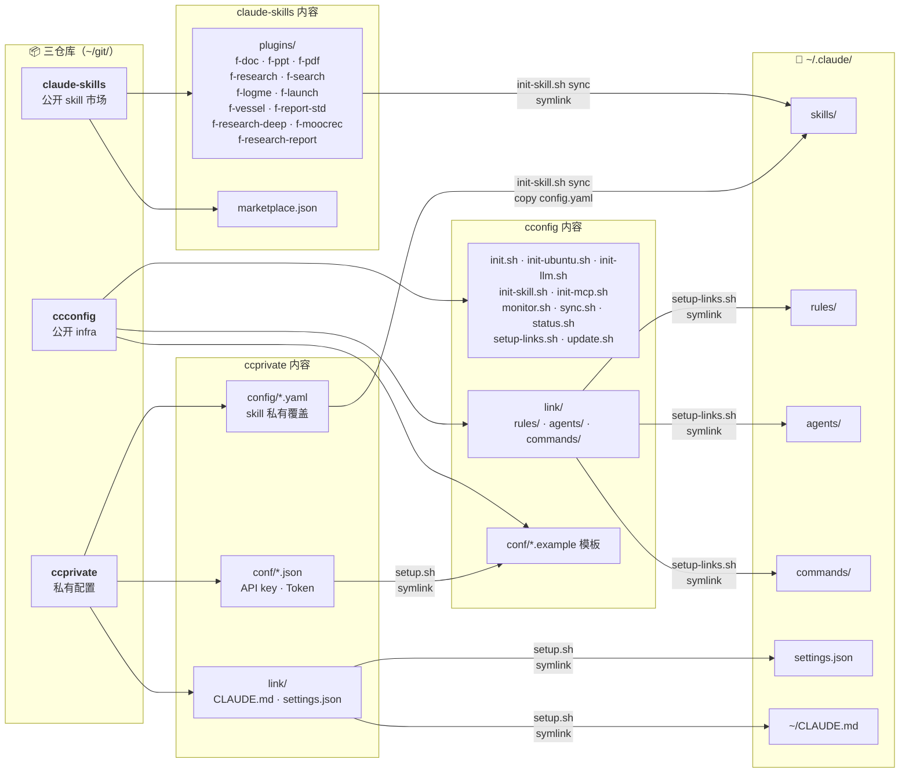

# ccconfig — Claude Code 配置中枢

> 统一管理 Claude Code 配置。三仓库公私分离。一键恢复到新终端。

## 概述

ccconfig 是 Claude Code 配置基础设施的公开部分。**三仓库模型**各司其职：

| 仓库 | 可见性 | 内容 |
|------|--------|------|
| **ccconfig** | 公开 | infra 脚本（init/bootstrap/sync/monitor）、rules、agents、commands |
| **[claude-skills](https://github.com/mengfanchun2017/claude-skills)** | 公开 | Skill 插件市场（Anthropic marketplace 兼容），12 个自建 f-* skill |
| **ccprivate** | 私有 | API key / Token / 个人配置，通过 symlink 穿透访问 |

ccconfig 本身不含任何密钥，可安全公开。Skill 插件独立发布为 claude-skills 仓库，符合 Anthropic marketplace 规范，可被任何 Claude Code 用户 `/plugin marketplace add` 安装。

- **环境**：Ubuntu/WSL 一键初始化
- **配置**：LLM 后端、MCP 服务器、API key 单一真相源（真实值在 ccprivate）
- **同步**：文件监听 + 自动 git commit/push，覆盖 `~/git/` 下所有仓库
- **Skills**：12 自建（symlink）+ 第三方 npx skills 自管（conf 清单）
- **Rules**：条件规则按路径加载（编码、git、python、搜索、飞书、godot）
- **Agents**：意图路由 agent
- **可选**：飞书 Bridge、OfficeCLI、PPT 生成、远程 SSH

## Why ccconfig?

Claude Code 配置分散在 `~/.claude/`、环境变量、MCP 服务器、skills 等多处。换机器或重装系统后需要数小时重新配置。ccconfig 解决三件事：

1. **统一管理** — 所有配置集中到 git 仓库，版本可控
2. **一键恢复** — 新终端 10 分钟从零到全功能（BOOTSTRAP 7 阶段）
3. **多设备同步** — auto-sync 守护进程自动 commit+push，多机配置一致

三仓库分工明确：ccconfig 管 infra、claude-skills 管 skill 插件、ccprivate 管密钥。ccconfig 用户一键获得全部能力；claude-skills 可独立使用（不需 ccconfig）。

> 适合：Claude Code 重度用户 / 多机器工作 / 想统一团队 Claude Code 配置的 TL

## 架构



> **密钥隔离**：`conf/*.json`（llm/claude/feishu/f-logme/f-doc/f-ppt/cloudflare/supabase/ubuntu）是 ccprivate→ccconfig 的 symlink，`.gitignore` 已忽略。公开仓库只含 `.example` 模板。详见 [BOOTSTRAP.md](BOOTSTRAP.md)。

## 目录结构

```
ccconfig/
├── init.sh                   # 入口（交互式二级菜单）
├── init-ubuntu.sh            # Ubuntu/WSL 全环境初始化
├── init-llm.sh               # LLM 后端切换
├── init-mcp.sh               # MCP 服务器管理
├── init-skill.sh             # Skills 同步管理
├── init-autostart.sh         # auto-sync systemd 服务
├── update.sh                 # 月度组件升级
│
├── status.sh                 # 状态检查（11 项）
├── monitor.sh                # 多仓库文件监听 + 自动 git 同步
├── sync.sh                   # 多仓库智能同步（云端↔本地）
├── setup-links.sh            # 公开部分符号链接（被 ccprivate/setup.sh 调用）
├── deps-check.sh             # 依赖完整性检查
│
├── conf/                     # 配置模板 + symlink
│   ├── *.json.example        # 公开模板（可提交）
│   ├── *.json                # → symlink 到 ccprivate/conf/（不跟踪）
│   ├── versions.json         # 组件版本（公开）
│   └── python-requirements.txt
│
├── lib/path-helper.sh        # 动态路径解析 + CCCONFIG_HOME
│
├── link/                     # → ~/.claude/ 符号链接源（公开部分）
│   ├── rules/                # 条件规则
│   ├── agents/               # 意图路由 agent
│   ├── commands/             # 自定义斜杠命令
│   └── projects/             # → symlink 到 ccprivate/link/projects/
│
├── hooks/
│   ├── pre-commit            # git hook：防私密文件意外提交
│   └── session-end-aggregator.sh  # Claude hook：自动 worklog
│
├── bin/init-ccprivate.sh     # 交互式引导：收集信息 → 创建 ccprivate 仓库
│
├── option-bridge/            # 可选：飞书消息 Bridge
├── option-officecli/         # 可选：OfficeCLI
├── option-llmswitch/         # 可选：LLM 网关代理
│
├── remote/                   # 远程访问（Tailscale + SSH + tmux）
├── windows-tools/            # Windows/WSL 互操作
│
├── LICENSE                   # MIT
├── BOOTSTRAP.md              # 新机器 0→1 拉起指南
├── CHANGELOG.md              # 变更历史
└── CONTRIBUTING.md           # 贡献指南
```

## 快速开始

> **新机器？** 从零开始 → 看 [BOOTSTRAP.md](BOOTSTRAP.md)（6 阶段，含 gh 登录 + 克隆 ccconfig + ccprivate）。

> **稳定版用户**：clone 默认 `release` 分支（稳定版本快照），不随 main 开发变动。
> **开发者**：用 `main` 分支跟踪最新代码。

```bash
# 1. 克隆 ccconfig（SSH 推荐，稳定版用 release 分支）
git clone git@github.com:<your-github-username>/ccconfig.git ~/git/ccconfig --branch release

# 2. 克隆 claude-skills（skill 插件仓库）
git clone git@github.com:<your-github-username>/claude-skills.git ~/git/claude-skills

# 3. 一键创建 ccprivate（交互式，收集 GitHub 账号 + LLM API Key）
bash ~/git/ccconfig/bin/init-ccprivate.sh

# 4. 系统初始化（Ubuntu + LLM + MCP + Skills + Python）
bash ~/git/ccconfig/init.sh all

# 5. 状态检查
bash ~/git/ccconfig/status.sh
```

> **已有 ccprivate？** 用 `bash ~/git/ccconfig/bin/init-ccprivate.sh --clone` 从 GitHub 克隆。

## 核心命令

| 命令 | 用途 |
|------|------|
| `bash init.sh` | 交互式菜单 |
| `bash init.sh all` | 一键全初始化 |
| `bash status.sh` | 完整状态检查（13 项） |
| `bash deps-check.sh` | 依赖完整性检查 |
| `bash update.sh all` | 月度组件升级 |
| `bash monitor.sh start` | 启动 auto-sync |
| `bash monitor.sh status` | 同步守护进程状态 |
| `bash setup-links.sh` | 重建公开符号链接 |
| `bash sync.sh --pull` | 强拉远程 |

## 日常维护

ccconfig 本身是一个 git 仓库，更新方式：

```bash
# 方式 1：update.sh 会自动先 git pull ccconfig（推荐）
bash update.sh all

# 方式 2：手动 git pull
cd ~/git/ccconfig && git pull
```

`update.sh all` 推荐每月跑一次，升级 Node.js、Claude Code、Python 包等组件。ccconfig 自身会先 `git pull` 确保脚本最新。

> auto-sync monitor 只自动 push，不自动 pull。ccconfig 更新需手动拉取。

## 状态检查覆盖

`status.sh` 每次 Claude Code session 启动检查 11 项：

1. 配置文件链接（settings.json、.config.json、CLAUDE.md、MEMORY.md、rules）
2. 核心依赖（git、bash、curl）
3. auto-sync 守护进程
4. GitHub 最后推送
5. MEMORY 最后更新
6. Git 项目状态
7. 飞书 lark-cli 状态
8. Playwright 浏览器测试
9. MCP 服务器健康检查（并行，24h 缓存）
10. 远程访问（SSH、Tailscale）
11. option-* 可选组件自动发现

## 自建 Skills

全部 13 个自建 skill 发布在 **[claude-skills](https://github.com/mengfanchun2017/claude-skills)** 仓库（Anthropic marketplace 兼容），`init-skill.sh sync` 自动 symlink 到 `~/.claude/skills/`。

| Skill | 用途 | 需外部服务？ |
|-------|------|-------------|
| `f-doc` | 飞书文档创建/更新/合并/拆分/对比 | lark-cli + 飞书租户 |
| `f-ppt` | PPT 生成（OfficeCLI 引擎） | officecli（可选飞书） |
| `f-pdf` | PDF 内容提取（文字/图片/表格/元数据） | PyMuPDF (pip) |
| `f-search` | 多源搜索编排（Tavily + MiniMax + WebSearch） | Tavily + MiniMax MCP |
| `f-research` | 快速研究（领域自动识别 + 三源并行） | 委托 f-search |
| `f-research-deep` | 批量深度研究（outline.yaml → JSON 输出） | Tavily + MiniMax MCP |
| `f-research-report` | 报告生成（JSON/大纲/素材 → Markdown） | 委托 f-doc + f-report-std |
| `f-report-std` | 报告写作规范（4 套模板：研究/分析/对比/方案） | 无 |
| `f-launch` | 项目启动脚手架 | f-logme + f-doc（可选） |
| `f-logme` | OKR/Worklog/Reflect/SUM 个人管理 | lark-cli + 飞书 Base |
| `f-moocrec` | 慕课推荐 | 飞书 Base |
| `f-vessel` | AI 浏览器操控（Vessel MCP） | Vessel 浏览器 |
| `f-sysarchi` | 系统分析师备考 — 暗号 `archi` 随工边做边学 | 无 |

> **独立使用**（不需 ccconfig）：`/plugin marketplace add <your-username>/claude-skills` 然后 `/plugin install f-doc@<your-username>-skills`。
> **ccconfig 用户**：`init-skill.sh sync` 自动从 `~/git/claude-skills/plugins/` symlink，第三方 skill 从 `conf/third-party-skills.txt` 通过 npx 安装。
> 详见 [claude-skills README](https://github.com/mengfanchun2017/claude-skills)。

## Auto-Sync

`monitor.sh` 监听 `~/git/` 下所有 git 仓库，自动 commit + push：

```bash
./monitor.sh start     # 启动守护进程（60s debounce）
./monitor.sh stop      # 停止
./monitor.sh status    # 查看状态
./monitor.sh log 50    # 最近 50 行日志
```

## 可选组件

```bash
bash option-bridge/init.sh       # 飞书 Bridge
bash option-officecli/init.sh    # OfficeCLI
bash option-llmswitch/init.sh    # LLM 网关代理
```

每个组件至少支持 `init.sh --status`。

## LLM 后端

```bash
bash init-llm.sh              # 交互式选择
bash init-llm.sh list         # 列出可用后端
bash init-llm.sh deepseek     # 切到 DeepSeek
bash init-llm.sh minimax      # 切到 MiniMax
```

## 远程访问

通过 Tailscale + SSH 连接桌面 Claude Code tmux session：

```bash
# 桌面 WSL（一次性配置）
bash remote/server/tmux-sshd.sh

# 笔记本连接
ssh <your-username>@<Tailscale IP> -p 2222  # 自动 attach 到 tmux
```

## 环境变量

| 变量 | 默认值 | 用途 |
|------|--------|------|
| `CCCONFIG_HOME` | `$HOME/git/ccconfig` | ccconfig 仓库路径 |
| `CCPRIVATE_HOME` | `$HOME/git/ccprivate` | ccprivate 仓库路径 |
| `CLAUDE_SKILLS_SRC` | `$HOME/git/claude-skills/plugins` | Skill 插件源目录 |

所有脚本优先读环境变量，默认值保持不变。自定义路径时 `export` 覆盖即可。

## 隐私模型

| 数据 | 存放 | 公开？ |
|------|------|--------|
| API key / Token | ccprivate/conf/*.json | 私有仓库 |
| 个人 CLAUDE.md / settings | ccprivate/link/ | 私有仓库 |
| 项目 memory | ccprivate/link/projects/ | 私有仓库 |
| Skill 插件 (SKILL.md + 模板) | claude-skills/plugins/ | 公开 |
| 脚本 / rule / agent / command | ccconfig/ | 公开 |
| .example 配置模板 | ccconfig/conf/*.example | 公开 |
| 版本号 / 依赖清单 | ccconfig/conf/versions.json | 公开 |

`hooks/pre-commit` 自动拦截私密文件提交。安全漏洞报告见 [SECURITY.md](SECURITY.md)。

## 开发

```bash
# 语法检查
for f in *.sh lib/*.sh option-*/*.sh; do bash -n "$f" && echo "$f OK"; done

# 验证 JSON 模板
python3 -c "import json; [json.load(open(f)) for f in __import__('glob').glob('conf/*.example')]"
```

### 添加 Option 组件

1. 创建 `option-<name>/`，含 `init.sh` 和 `README.md`
2. `init.sh` 支持 `--status` 标志
3. 自动被 `status.sh` 发现

### 添加 Skill

1. 在 `~/git/claude-skills/plugins/<name>/` 创建 skill（`SKILL.md` + 可选 `config.yaml.example`）
2. 更新 `~/git/claude-skills/.claude-plugin/marketplace.json` 注册 plugin 入口
3. 跑 `bash init-skill.sh sync` 同步到 `~/.claude/skills/`
4. 私有配置（token 等）放到 `ccprivate/config/<name>.yaml`，sync 时自动覆盖

## 许可证

MIT —— 见 [LICENSE](LICENSE)
