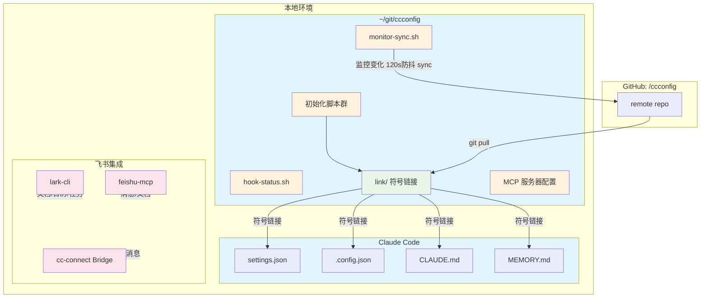
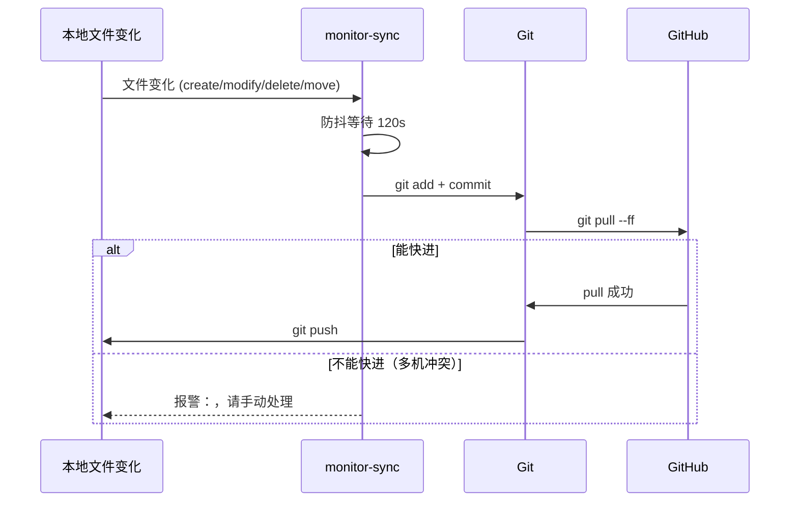

# Claude Config

Claude Code 配置文件仓库，用于跨设备同步配置。同步到 GitHub: [<your-github-username>/ccconfig](https://github.com/<your-github-username>/ccconfig)

---

## 整体架构



---

## 目录结构

```text
ccconfig/
├── init.sh                    # 统一初始化入口（一键/交互式）
├── ubuntuinit.sh              # 合一初始化脚本（Git + Claude + 环境 + auto-sync）
├── feishuinit.sh              # 飞书基础配置（lark-cli，所有环境）
├── cconnectinit.sh            # cc-connect Bridge（多用户飞书 WebSocket）
├── claudeinit.sh              # MCP 服务器安装与配置
├── hook-status.sh             # 状态检查（Claude Code 启动时自动调用）
├── monitor-sync.sh            # 文件监控与自动同步（主脚本）
├── init-enable-autostart.sh   # auto-sync systemd 自启动配置
├── conf-ubuntu.json           # ubuntuinit.sh 配置（Git 用户信息）
├── conf-claude.json           # claudeinit.sh 配置（MCP 服务器）
├── conf-feishu.json           # 飞书配置（lark-cli + cc-connect 多用户）
├── conf-llm.json              # LLM 模型配置（多后端切换）
├── link/                      # 符号链接目录（同步到 GitHub）
│   ├── CLAUDE.md              # 全局 AI 指令
│   ├── .config.json           # MCP 配置、用户状态
│   ├── settings.json           # Claude Code 全局设置
│   └── -home-francis-git/     # 项目记忆
│       └── MEMORY.md
├── mcp-status/
│   └── status-mcp.js          # 状态 MCP 服务器
└── cc-connect.service         # cc-connect systemd 服务文件
```

---

## 配置文件架构

### 符号链接（本地 ↔ GitHub 同步）

| 本地路径 | → | ccconfig/link/ | GitHub |
|---------|---|----------------|--------|
| `~/.claude/settings.json` | → | `link/settings.json` | → GitHub |
| `~/.claude/.config.json` | → | `link/.config.json` | → GitHub |
| `~/CLAUDE.md` | → | `link/CLAUDE.md` | → GitHub |
| `~/.claude/projects/-home-francis-git/memory/MEMORY.md` | → | `link/-home-francis-git/MEMORY.md` | → GitHub |

### 配置同步流程



**pull --ff**：解决多机同时 push 的冲突（不能快进时报警"请手动处理"）

---

## 快速开始

### 新环境初始化（所有环境）

```bash
# 最简单：一键初始化（5步全自动）
bash ~/git/ccconfig/init.sh all

# 或分步执行：
# 1. 终端基础环境（完成后 Claude Code 可用）
bash ~/git/ccconfig/ubuntuinit.sh

# 2. 飞书基础配置（lark-cli，所有环境）
bash ~/git/ccconfig/feishuinit.sh

# 3. MCP 服务器安装（需要 Claude Code 已安装）
bash ~/git/ccconfig/claudeinit.sh

# 4. Skills 安装
bash ~/git/ccconfig/skillinit.sh

# 5. 仅 Bridge 环境额外运行（多用户飞书桥接）
bash ~/git/ccconfig/cconnectinit.sh

# 或使用交互式菜单
bash ~/git/ccconfig/init.sh
```

### 日常使用

```bash
# 进入 Claude 后查看状态
bash ~/git/ccconfig/hook-status.sh

# 或在 Claude 中说"运行 status 工具"
```

---

## monitor-sync.sh 用法

文件监控与自动同步脚本，管理 inotifywait 进程。

```bash
cd ~/git/ccconfig

./monitor-sync.sh start     # 后台启动监控
./monitor-sync.sh stop      # 停止监控
./monitor-sync.sh status    # 查看状态
./monitor-sync.sh log 50    # 查看最近50行日志（默认20）
./monitor-sync.sh tail      # 实时跟踪日志
./monitor-sync.sh monitor   # 前台持续监控（调试用，Ctrl+C退出）
```

**常用组合**：
- 首次启动：`./monitor-sync.sh start`
- 查看状态：`./monitor-sync.sh status`
- 调试文件变化：`./monitor-sync.sh monitor`（前台实时显示所有变化）

### 日志位置
- PID 文件：`.monitor-sync.pid`
- 日志文件：`.monitor-sync.log`

### systemd 自启动

```bash
# 启用/禁用/查看状态
bash ~/git/ccconfig/init-enable-autostart.sh enable
bash ~/git/ccconfig/init-enable-autostart.sh disable
bash ~/git/ccconfig/init-enable-autostart.sh status
```

---

## 飞书集成

### 组件架构

| 组件 | 安装方式 | 用途 |
|------|---------|------|
| lark-cli | feishuinit.sh | 终端创建文档/日历/任务（所有环境） |
| feishu-mcp | claudeinit.sh | Claude 发消息、读文档 |
| cc-connect | cconnectinit.sh | Bridge 接收飞书消息（WebSocket，多用户） |

> **ccbot → cc-connect 迁移**：cc-connect 替代了旧的 ccbot（已删除 bridgeinit.sh、ccbot.service）。原生支持多用户、多飞书 App、多项目。

### 多用户架构

```
飞书用户A → 飞书App A → cc-connect Project "userA"
    ├── agent: claudecode
    ├── workDir: /home/francis/git
    ├── CLAUDE_CONFIG_DIR: ~/.claude
    └── sessions: 按 chatId 独立

飞书用户B → 飞书App B → cc-connect Project "userB"
    ├── agent: claudecode
    ├── workDir: /home/francis/git/friend1
    ├── CLAUDE_CONFIG_DIR: ~/.claude-friend1
    └── sessions: 按 chatId 独立（与用户A 完全隔离）
```

### 添加新用户

1. 在[飞书开放平台](https://open.feishu.cn)创建新的企业自建应用
2. 配置：机器人能力 → 长连接事件 im.message.receive_v1 → 权限 im:message:send_as_bot 等
3. 编辑 `conf-feishu.json`，在 `cconnect.users` 数组中新增用户
4. 运行 `bash ccconfig/cconnectinit.sh` 重新生成配置并重启

### 配置说明（conf-feishu.json）

```json
{
  "lark": {
    "appId": "...",      // lark-cli 用的飞书应用（文档/日历/任务）
    "appSecret": "...",
    "brand": "feishu"
  },
  "ccconnect": {
    "users": [
      {
        "name": "francis",
        "feishuAppId": "cli_xxx",       // 该用户的飞书 App
        "feishuAppSecret": "xxx",
        "workDir": "/home/francis/git", // Claude Code 工作目录
        "claudeConfigDir": "/home/francis/.claude"  // Claude Code 配置隔离目录
      }
    ]
  }
}
```

### cc-connect 管理

```bash
# 查看状态
systemctl --user status cc-connect

# 重启
systemctl --user restart cc-connect

# 查看日志
journalctl --user -u cc-connect -f

# 修改配置后重新生成
bash ccconfig/cconnectinit.sh
```

### 飞书文档操作（必须用 lark-cli）

```bash
lark-cli docs +create \
  --title "文档标题" \
  --as user \
  --wiki-node CyZ6wmItQiso3AkbjZBcP3vtnAb \
  --markdown - << 'EOF'
# 标题

内容...
EOF
```

### 飞书 MCP 功能

- `feishu_send_message` - 发送消息
- `feishu_get_messages` - 获取消息历史
- `feishu_get_doc` - 读取文档
- `feishu_get_calendar` - 查询日程
- `feishu_create_event` - 创建日程
- `feishu_create_task` / `feishu_list_tasks` - 任务管理

---

## MCP 服务器

| MCP | 命令 | 功能 |
|-----|------|------|
| tavily | `npx tavily-mcp` | 网络搜索 |
| minimax | `uvx minimax-coding-plan-mcp` | MiniMax 编程模型 |
| minimax-mcp | `uvx minimax-mcp` | MiniMax 多模态 |
| octocode | `npx -y octocode-mcp@latest` | GitHub 代码搜索 |
| supabase | `npx -y @supabase/mcp-server-supabase` | 数据库操作 |
| status | `node mcp-status/status-mcp.js` | 环境状态 |
| feishu | `npx -y @china-mcp/feishu-mcp` | 飞书消息/文档 |

查看 MCP 状态：`claude mcp list`

---

## 常见问题

### Q: auto-sync 显示"进程未运行"但实际在运行？
A: PID 文件名不匹配导致。运行 `bash ~/git/ccconfig/hook-status.sh` 检查，进程实际运行时状态应显示"进程运行中 (PID: xxx)"。

### Q: `./monitor-sync.sh monitor` 报 command not found？
A: `monitor` 是 `./monitor-sync.sh` 的参数，不是独立命令。正确用法：`./monitor-sync.sh monitor`

### Q: 如何确认 auto-sync 实际在运行？
A: `ps aux | grep monitor-sync` 或 `bash ~/git/ccconfig/monitor-sync.sh status`

### Q: 如何手动同步配置？

```bash
cd ~/git/ccconfig
git add -A
git commit -m "描述"
git push origin main
```

---

## 内部实现

### hook-status.sh 检测逻辑
检查 `.monitor-sync.pid` 文件是否存在且进程存活，与 systemd service 文件（`~/.config/systemd/user/claude-auto-sync.service`）的自启动配置独立。

### inotifywait 免 sudo 安装

```bash
mkdir -p ~/.local/lib && cd /tmp
curl -sLO http://archive.ubuntu.com/ubuntu/pool/universe/i/inotify-tools/inotify-tools_3.22.6.0-4_amd64.deb
dpkg-deb -x inotify-tools_*.deb . && cp usr/bin/inotify* ~/.local/bin/
curl -sLO http://archive.ubuntu.com/ubuntu/pool/universe/i/inotify-tools/libinotifytools0_3.22.6.0-4_amd64.deb
dpkg-deb -x libinotifytools0_*.deb . && cp usr/lib/x86_64-linux-gnu/libinotifytools.so.0 ~/.local/lib/
```
