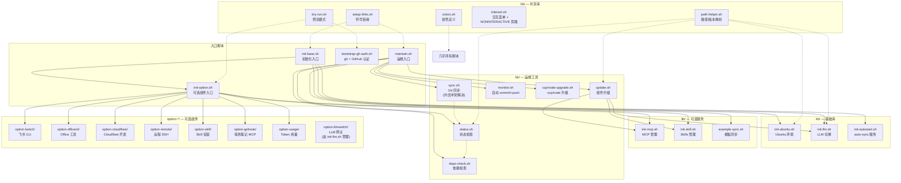

# ccconfig — Claude Code 配置中枢

> 统一管理 Claude Code 配置。三仓库公私分离。一键恢复到新终端。

> **Name origin**: `ccconfig = CC + config` — `CC` = **Claude Code**，`config` = **configuration**。本仓库是 Claude Code 配置管理基础设施。

[](https://github.com/mengfanchun2017/ccconfig/actions/workflows/check.yml)
[](LICENSE)
[](https://github.com/mengfanchun2017/ccconfig/commits/main)
[](.github/workflows/check.yml)

[English](../README.md) · [中文](README.md)

## 概述

ccconfig 是 Claude Code 配置基础设施的公开部分。**三仓库模型**各司其职：

| 仓库 | 可见性 | 内容 |
|------|--------|------|
| **ccconfig** | 公开 | infra 脚本、.example 模板（rules/agents/conf） |
| **[skill](https://github.com/mengfanchun2017/skill)** | 公开 | 17 个 f-* skill 插件（marketplace 兼容） |
| **ccprivate** | 私有 | API key / Token / 个人配置，symlink 穿透访问 |

ccconfig 本身不含任何密钥。

## 架构图


```mermaid
flowchart TB
  subgraph entry["入口脚本"]
    initBase["init-base.sh
    初始化入口"]
    maintain["maintain.sh
    运维入口"]
    bootstrap["bootstrap-gh-auth.sh
    gh + GitHub 认证"]
    initOption["init-option.sh
    可选组件入口"]
  end

  subgraph base["lib/ — 基础库"]
    libUbuntu["init-ubuntu.sh
    Ubuntu 环境"]
    libLlm["init-llm.sh
    LLM 切换"]
    libAutostart["init-autostart.sh
    auto-sync 服务"]
  end

  subgraph option["lib/ — 可选服务"]
    libMcp["init-mcp.sh
    MCP 管理"]
    libSkill["init-skill.sh
    Skills 管理"]
    exampleSync["example-sync.sh
    模板同步"]
  end

  subgraph ops["lib/ — 运维工具"]
    status["status.sh
    状态检查"]
    sync["sync.sh
    Git 同步
    (内含冲突解决)"]
    update["update.sh
    组件升级"]
    monitor["monitor.sh
    自动 commit+push"]
    deps["deps-check.sh
    依赖检查"]
    ccprivUp["ccprivate-upgrade.sh
    ccprivate 升级"]
  end

  subgraph shared["lib/ — 共享库"]
    pathHelper["path-helper.sh
    路径/版本解析"]
    colors["colors.sh
    颜色定义"]
    dryrun["dry-run.sh
    预览模式"]
    interact["interact.sh
    交互菜单 + NONINTERACTIVE 旁路"]
    setupLinks["setup-links.sh
    符号链接"]
  end

  subgraph optDir["option-*/ — 可选组件"]
    optLarkcli["option-larkcli/
    飞书 CLI"]
    optOfficecli["option-officecli/
    Office 工具"]
    optCloudflare["option-cloudflare/
    Cloudflare 开发"]
    optRemote["option-remote/
    远程 SSH"]
    optSkill["option-skill/
    Skill 安装"]
    optGetnote["option-getnote/
    得到笔记 MCP"]
    optUsage["option-usage/
    Token 用量"]
    optLlms["option-llmswitch/
    LLM 网关
    (由 init-llm.sh 管理)"]
  end

  %% 入口调用关系
  initBase --> libUbuntu
  initBase --> libLlm
  initBase --> initOption
  maintain --> status
  maintain --> sync
  maintain --> update
  maintain --> monitor
  maintain --> deps
  maintain --> ccprivUp
  maintain --> exampleSync

  %% init-option 调用关系（larkbridge 委托外部仓 ccbridge，此处不画）
  initOption --> optLarkcli
  initOption --> optOfficecli
  initOption --> optCloudflare
  initOption --> optRemote
  initOption --> optSkill
  initOption --> optGetnote
  initOption --> optUsage
  initOption --> libMcp
  initOption --> libSkill

  %% 运维工具内部调用
  sync -.-> status
  status -.-> deps
  update --> libLlm
  update --> libMcp
  update --> libSkill
  initBase --> libAutostart

  %% 共享库
  pathHelper -.-> libUbuntu
  pathHelper -.-> libLlm
  pathHelper -.-> update
  pathHelper -.-> status
  colors -.-> 几乎所有脚本
  dryrun -.-> bootstrap
  dryrun -.-> initOption
  setupLinks -.-> maintain
  setupLinks -.-> initBase
```

## 目录结构

```
ccconfig/
├── bootstrap-gh-auth.sh      # 一行式起步（curl|bash：装 git + clone ccconfig）
├── init-base.sh              # 初始化统一入口
├── maintain.sh               # 运维入口（status/self/upgrade/sync/monitor/deps/fix）
├── init-option.sh            # 可选组件安装入口（分组菜单）
│
├── lib/                      # 脚本库
│   ├── init-ubuntu.sh        # Ubuntu/WSL 环境初始化（Node/Claude/uv/symlink）
│   ├── init-llm.sh           # LLM 后端切换（多预设 + gateway）
│   ├── init-mcp.sh           # MCP 服务器注册管理
│   ├── init-skill.sh         # Skills 同步
│   ├── init-autostart.sh     # auto-sync systemd 服务
│   ├── monitor.sh            # inotify 监听 + 自动 git 同步
│   ├── status.sh             # 14 项状态检查
│   ├── sync.sh               # 多仓库 Git 同步（内含冲突解决）
│   ├── update.sh             # 月度组件升级
│   ├── example-sync.sh       # .example ↔ ccprivate 双向同步
│   ├── ccprivate-upgrade.sh  # ccprivate 结构升级
│   ├── deps-check.sh         # 依赖检查
│   ├── setup-links.sh        # 公开符号链接
│   ├── path-helper.sh        # 路径解析 + 版本文件读写
│   ├── colors.sh              # 颜色变量
│   ├── dry-run.sh             # 预览模式
│   ├── interact.sh           # 统一交互菜单库（confirm/menu_select/prompt）
│   ├── install-inotify.sh    # inotify-tools 安装
│   ├── mcp-manager.sh        # MCP 配置管理器
│   ├── shell_init.sh         # Shell 环境初始化片段
│   └── claude-auto-sync.service # systemd service 模板（被 init-autostart.sh 使用）
│
├── conf/                     # 公开配置模板
│   ├── *.json.example        # 模板（复制到 ccprivate/conf/ 后编辑）
│   ├── versions.json         # 组件版本文件（npm 包为 latest）
│   ├── schema/mcp.schema.json # MCP 配置校验
│   └── python-requirements.txt
│
├── templates/                # .example 模板目录
│   ├── rules/*.md.example    # 条件规则模板（9 个）
│   ├── agents/*.md.example   # Agent 模板（2 个）
│   └── settings.json.example # Claude Code 配置模板
│
├── option-larkcli/           # 可选：飞书 lark-cli
├── option-officecli/         # 可选：Office CLI（PPT/docx/xlsx）
├── option-cloudflare/        # 可选：Cloudflare 开发环境
├── option-remote/            # 可选：Tailscale + SSH 远程
├── option-skill/             # 可选：Skill 安装（包装 lib/init-skill.sh）
├── option-llmswitch/         # 内部：LLM 网关（init-llm.sh 自动管理）
├── bin/memory-check.sh       # Memory 过期检查
├── hooks/pre-commit          # 防私密文件误提交
├── tests/                    # 自动化测试（mock 隔离，零网络）
├── docs/                     # 设计文档 + ADR（docs/adr/）
├── .github/workflows/        # CI（shellcheck + shfmt）
├── .claude/settings.json     # 本仓库 Claude Code 设置
├── CLAUDE.md / BOOTSTRAP.md / CHANGELOG.md
└── LICENSE / .editorconfig
```

## 快速开始

> **新机器？** 详细引导 → [BOOTSTRAP.md](BOOTSTRAP.md)

```bash
# 1. Clone
 git clone git@github.com:<user>/ccconfig.git ~/git/ccconfig

# 2. gh 认证 + ccprivate（建仓或 clone 已有，二合一）
bash ~/git/ccconfig/init-bootstrap.sh

# 3. 基础初始化（Ubuntu → LLM → 链接/服务，3 步）
bash ~/git/ccconfig/init-base.sh all
#    全自动非交互:
#    bash ~/git/ccconfig/init-base.sh all --yes

# 4. 可选组件（MCP/Skills/CLI，独立一步）
bash ~/git/ccconfig/init-option.sh

# 5. 全量状态检查
bash ~/git/ccconfig/maintain.sh status
```

## 特色亮点

### 🔀 LLM 后端随心切

```bash
bash lib/init-llm.sh              # 交互菜单
bash lib/init-llm.sh deepseek     # 一条命令切
bash lib/init-llm.sh gateway      # 切到网关（自动装启 option-llmswitch）
```

- **多预设管理** — MiniMax/DeepSeek/Gateway 内置，支持自建自定义
- **Gateway 自动切换** — LLM 代理网关按高峰/非高峰时段自动切后端
- **OpenAI Bridge** — 遇到 OpenAI-only 端点自动启协议转换 proxy

> **切换后旧 session 报 400 model not supported？** session 记住了上次的模型名，`/model`
> 重选新模型即可（或 `claude -r <session-id> --model <模型>` 命令行覆盖）。详见
> `option-llmswitch/README.md` 已知问题 #3。

### 🧩 可选组件（分组菜单）

`init-option.sh` 按组展示，每项带状态标记：

```
--CLI--
 1) bat         ✓ 已安装 — cat 替代，语法高亮+行号

--Claude--
 2) mcp         ✗ 未配置（bash init-option.sh mcp）
 3) skill       ✓ 17 个 skill 已安装
 4) usage       ✓ timer 运行中 — Token 用量追踪
 5) llmswitch   [auto] — 由 init-llm 自动管理

--飞书--
 6) larkcli     ✓ lark-cli 已安装 — 飞书 CLI

--其他--
 7) officecli   ✓ OfficeCLI 已安装 — 生成 .pptx/.docx
 8) remote      ✗ 未配置 — SSH + Tailscale 远程
...

  a) 全部安装  0) 返回
```

### 🔐 公开/私密分离

| 仓库 | 存什么 | 公开？ |
|------|--------|--------|
| ccconfig | 脚本、.example 模板 | ✅ 开源 |
| fancypowershell | Windows PowerShell 工具集 | ✅ 开源 |
| skill | 17 个 f-* skill 插件 | ✅ marketplace |
| ccprivate | API key、token、个人配置 | ❌ 私有 |

### 🔄 Auto-Sync 守护进程

systemd 服务，inotify 监听 `~/git/`，60s debounce 自动 commit+push。

### 🚀 一行命令起步

```bash
curl -fsSL https://raw.githubusercontent.com/mengfanchun2017/ccconfig/main/bootstrap-gh-auth.sh | bash
```

## 核心命令

| 命令 | 用途 |
|------|------|
| `bash init-base.sh` | 交互式菜单 |
| `bash init-base.sh all` | 一键基础初始化（Ubuntu → LLM → 链接/服务，3 步） |
| `bash init-base.sh all --yes` | 全自动非交互（auth 类组件跳过） |
| `bash init-option.sh` | 可选组件菜单（分组展示，可单独补装） |
| `bash maintain.sh status` | 完整状态检查 |
| `bash maintain.sh fix` | 自动修复断链 |
| `bash maintain.sh monitor start` | 启动 auto-sync |
| `bash maintain.sh self skill` | 更新 skills |
| `bash maintain.sh example` | 检测 .example 模板差异 |
| `bash lib/init-llm.sh` | 切换 LLM 后端 |
| `bash lib/update.sh all` | 月度组件升级 |

## 状态检查

`maintain.sh status` 检查：链接/依赖/auto-sync/Git 推送/Memory/项目/飞书/MCP/可选组件/Skills/模板同步。

## 自建 Skills

全部 17 个 skill 发布在 **[skill](https://github.com/mengfanchun2017/skill)** 仓库：ffeishu / fpptx / fdiagram / fdocx / fsearch / flogme 等。
`bash lib/init-skill.sh sync` 从 `~/git/skill/plugins/` symlink 到 `~/.claude/skills/`。

## 环境变量

| 变量 | 默认值 | 用途 |
|------|--------|------|
| `CCCONFIG_HOME` | `$HOME/git/ccconfig` | ccconfig 仓库路径 |
| `CCPRIVATE_HOME` | `$HOME/git/ccprivate` | ccprivate 仓库路径 |

## 版本里程碑

### v3.x — 交互菜单 API 收口（2026-08-10）

ccconfig 历史上每个脚本各自写 `read -p "选择 [1-N]: "` + 数字校验 + `menu_num` 兜底，散落在 8+ 文件。新版统一收口到 `lib/interact.sh` 单一 API：

```bash
source lib/interact.sh
c=$(menu_select "标题" "项1" "项2" "返回")  # 返回序号字符串
case "$c" in 1) ... ;; 2) ... ;; 3) return ;; esac

confirm "是否继续？" n
name=$(prompt "用户名")
pwd=$(prompt_password "Token")
```

**4 个核心坑**（详见 [ADR-0012](docs/adr/0012-interact-p0-no-gum.md)）：
1. 菜单显示走 stderr（避开 `c=$(...)` 命令替换截走列表）
2. `read -p` 从 `/dev/tty` 读（避开管道阻塞/EOF）
3. `while+case` 不能 `*) continue` 重入菜单（每次重入重新打印列表）
4. items 必须纯文本，函数自动加 "1) 2) 3)"——禁止 caller 传 "1) xxx"

**单元测试**：`bash tests/test-interact.sh`（22 case，覆盖 EOF/OOR/非法字符/双前缀回归/stdout-stderr 分离）。

**回归 tag**：`interact-api-unify-20260810`（如需回滚：`git checkout interact-api-unify-20260810`）。

caller 总代码量 -184 行，新增测试 171 行。

## 开发

```bash
for f in *.sh lib/*.sh option-*/*.sh; do bash -n "$f" && echo "$f OK"; done
```

### 添加 Option

1. 创建 `option-<name>/`，含 `init.sh` + `--status` 支持
2. 在 `init-option.sh` 的 `MENU_GROUPS` 和 `OPT_DESC` 中注册
3. 自动被 `maintain.sh status` 发现

### 添加 Skill

1. 在 `~/git/skill/plugins/<name>/` 创建 `SKILL.md`
2. 注册到 `.claude-plugin/marketplace.json`
3. `bash lib/init-skill.sh sync` 同步

## 许可证

MIT — 见 [LICENSE](LICENSE)
