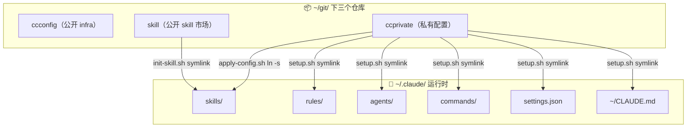

# ccconfig 产品架构

> 面向用户和贡献者。回答"ccconfig 是什么、怎么工作、我怎么用"。

## 产品定位

ccconfig 是 Claude Code 配置管理的基础设施。目标：**新机器 10 分钟拉起全功能 CC 终端，多设备配置一致，可持续跟随上游更新**。

三个仓库分工明确：

| 仓库 | 可见性 | 定位 | 用户操作 |
|------|--------|------|----------|
| **ccconfig** | 公开 | infra 脚本 + .example 模板（rules/agents/conf） | fork 或 clone，定期 git pull |
| **skill** | 公开 | 16 个 f-* skill 插件 marketplace | clone 或 `/plugin marketplace add` |
| **ccprivate** | 私有 | API key + token + 个人配置 | 运行 `init-ccprivate-repo.sh` 自建 |

ccconfig 本身不含任何密钥，可安全公开。skill 可独立使用（不依赖 ccconfig）。ccprivate 每人自建。

## 三仓库架构



## 配置数据流

### 系统配置（JSON，程序消费）

```
ccprivate/conf/llm.json ──resolve_conf() 读──→ init-llm.sh 读取──→ ~/.claude/.config.json
ccprivate/conf/claude.json ──resolve_conf() 读──→ init-mcp.sh 读取──→ ~/.claude/.config.json
```

ccconfig 脚本通过 `resolve_conf()` 直接读 `ccprivate/conf/*.json`（路径硬编码 `$CCPRIVATE_HOME/conf/`），无需中间 symlink。`ccconfig/conf/*.json.example` 是公开模板，首次初始化时复制到 ccprivate。

### Skill 配置（YAML，skill 直接读取）

```
ccprivate/skill-config/f-logme.yaml ──apply-config.sh ln -s──→ ~/.claude/skills/f-logme/config.yaml
                                                          └── f-logme/log_write.py open('config.yaml') 读到真实 token
```

skill 的 Python 脚本 `open('config.yaml')` 自动跟踪 symlink 读到 ccprivate 的真实值。修改 ccprivate 立即生效，无需重跑脚本。

### 个人配置（直接 symlink 到 ~）

```
ccprivate/link/CLAUDE.md ──setup.sh ln -s──→ ~/CLAUDE.md
ccprivate/link/settings.json ──setup.sh ln -s──→ ~/.claude/settings.json
ccprivate/link/projects/ ──setup.sh ln -s──→ ~/.claude/projects/（memory）
```

### 运行时配置（ccprivate → ~/.claude/）

```
ccprivate/rules/ ──setup.sh ln -s──→ ~/.claude/rules/
ccprivate/agents/ ──setup.sh ln -s──→ ~/.claude/agents/
ccprivate/commands/ ──setup.sh ln -s──→ ~/.claude/commands/
```

ccconfig/link/ 存放 `.example` 模板（如 `rules/code.md.example`），用户修改 ccprivate/rules/ 下的文件，不受 ccconfig 更新影响。新模板通过 `maintain.sh example promote` 手动合并。

## 目录结构

```
~/git/
├── ccconfig/                   # ← 用户 fork/clone 这个
│   ├── bootstrap-gh-auth.sh    # Step 2: 装 gh + GitHub 认证
│   ├── init.sh                 # 统一入口（交互式二级菜单）
│   ├── maintain.sh             # 统一运维入口
│   ├── conf/               # 配置模板（*.example，不包含真实密钥）
│   ├── lib/                    # 脚本库 + 子脚本
│   │   ├── init-ubuntu.sh      # Ubuntu/WSL 全环境初始化
│   │   ├── init-llm.sh         # LLM 后端切换
│   │   ├── init-mcp.sh         # MCP 服务器管理
│   │   ├── init-skill.sh       # Skills 同步（4+1 阶段 pipeline）
│   │   ├── init-autostart.sh   # auto-sync systemd 服务
│   │   ├── update.sh           # 月度组件升级
│   │   ├── status.sh           # 14 项状态检查
│   │   ├── monitor.sh          # 多仓库文件监听 + 自动 git 同步
│   │   ├── sync.sh             # 多仓库智能同步
│   │   ├── setup-links.sh      # 公开部分符号链接
│   │   ├── deps-check.sh       # 依赖完整性检查
│   │   ├── path-helper.sh      # 动态路径解析库
│   │   ├── git-conflict.sh     # Git 冲突解决公共库
│   │   └── colors.sh           # 终端颜色定义
│   ├── link/                   # .example 模板目录（运行时在 ccprivate）
│   │   ├── rules/              # 条件规则模板（9 个，.md.example）
│   │   ├── agents/             # 意图路由 agent 模板（.md.example）
│   │   └── commands/           # 自定义命令（运行时在 ccprivate/commands/）
│   ├── init-ccprivate-repo.sh   # ccprivate 一键创建向导
│   ├── hooks/                  # git pre-commit + SessionEnd hook
│   ├── option-*/               # 可选组件（bridge/officecli/llmswitch/remote/cloudflare）
│   └── docs/                   # 架构/升级/ADR/进度 文档
│
├── skill/              # ← 用户 clone 这个（或 /plugin marketplace add）
│   ├── .claude-plugin/marketplace.json
│   ├── plugins/                # 16 个 plugin
│   └── option-vessel/          # f-vessel 配套安装器
│
└── ccprivate/                  # ← 用户运行 init-ccprivate-repo.sh 自建
    ├── conf/*.json             # API key / token 真实值
    ├── rules/*.md              # 运行时条件规则
    ├── agents/*.md             # 运行时 agent
    ├── commands/                # 运行时自定义命令
    ├── skill-config/*.yaml     # skill 私有配置覆盖
    ├── link/                   # 个人 CLAUDE.md + settings.json + memory
    ├── setup.sh                # 私有+公开 symlink 一键建立
    └── bin/apply-config.sh     # skill config.yaml 覆盖
```

## 初始化流程

新机器从零到全功能：7 个阶段（详见 [BOOTSTRAP.md](../BOOTSTRAP.md)）

```
阶段 0: Windows 前置（WSL2 + Ubuntu 24.04 + PowerShell 7）
阶段 1: OS 基础（apt update + git/curl/wget）
阶段 2: gh CLI（GitHub 命令行）
阶段 3: SSH Key + GitHub 认证
阶段 4: 克隆三仓库 + init-ccprivate-repo.sh
阶段 5: init-base.sh all（Ubuntu + LLM + MCP）
阶段 6: 克隆所有项目
阶段 7: maintain.sh status 验证
```

关键脚本调用链：

```
init-base.sh all
  ├── 1/4 init-ubuntu.sh     # 系统包 + Node + uv + Claude Code + git config + fonts + systemd
  ├── 2/4 init-llm.sh        # LLM 后端配置（API key → settings.json）
  ├── 3/4 init-mcp.sh        # MCP 服务器安装 + 配置
  └── 4/4 maintain.sh finalize # 收尾：链接修复 + auto-sync 启动 + 状态验证
```

symlink 建立链：

```
ccprivate/setup.sh
  ├── ~/CLAUDE.md, ~/.claude/settings.json → ccprivate/link/
  ├── ~/.claude/rules → ccprivate/rules
  ├── ~/.claude/agents → ccprivate/agents
  ├── ~/.claude/commands → ccprivate/commands
  ├── ccconfig/link/projects → ccprivate/link/projects
  └── 调用 ccconfig/lib/setup-links.sh（shell_aliases + pre-commit hook）
```

## 日常维护

### 自动同步（monitor.sh）

```
inotify 监听 ~/git/ 下所有仓库
  → 文件变化 → 60s debounce → git add + commit + push
  → 仅 push 真正改动的仓库
  → 30s push 超时 + 3x 重试
```

systemd user service 守护，开机自启。`monitor.sh status` 查看各仓库状态。

### 状态检查（maintain.sh status）

每次 Claude Code 启动自动运行（SessionStart hook）。14 项检查：
1. 配置文件链接 2. 核心依赖 3. auto-sync 4. 最后推送 5. MEMORY 更新
6. Git 项目状态 7. 飞书 lark-cli 8. Playwright 9. MCP 服务器（并行，24h 缓存）
10. 远程连接（SSH + Tailscale） 11. option-*
12. Example 模板同步（ccconfig .example vs ccprivate 运行时） 可选组件

## 升级策略

详见 [upgrade-guide.md](upgrade-guide.md)

```
日常：monitor.sh 自动 push（不自动 pull）
月度：update.sh all（Node/Claude/gh/uv/pip/MCP/skills 全升级）
Skill：init-skill.sh sync（从 skill 拉最新）
ccconfig 自身：git pull（update.sh 开头自动执行）
大版本：git pull → 看 CHANGELOG → 可能需重跑 init
```

## Skill 系统

### 五层架构

```
Tier 0: CLI/MCP 工具（真正的原语）
  lark-cli         飞书 CLI
  OfficeCLI        Office OpenXML 工具
  tavily           英文搜索 API
  minimax          中文搜索 + 多模态生成 API
  whiteboard-cli   飞书白板 SVG 渲染

Tier 1: 能力 Skill（包装工具加约定）
  f-search         多源搜索编排（三源并行 + 去重 + 标注）
  f-pdf            PDF 内容提取（PyMuPDF）
  f-diagram        代码驱动图表生成（Mermaid + whiteboard-cli）
  f-docx           Word .docx 生成（OfficeCLI 引擎）
  f-xlsx           Excel .xlsx 生成（OfficeCLI 引擎）
  f-pptx           PPTX 生成（OfficeCLI 引擎 + autofit 后处理）

Tier 2: 编排层（路由 + 文档生命周期）
  f-feishu         飞书文档统一入口 → 委托 Tier 1 skill + lark-cli

Tier 3: 领域方法论（领域知识 + 框架）
  f-research-frame  4 领域研究方法论（customer/generic/market/technical）
  f-report-std     报告写作横向规范（4 套模板）
  f-sysarchi       系统分析师备考方法论

Tier 4: 应用 Skill（最终用户工作流）
  f-research-report  报告生成 → 委托 f-research-frame + f-report-std + f-feishu
  f-logme            个人管理系统（OKR/Worklog/Reflect/SUM）
  f-launch           项目启动脚手架（8 种项目类型）
  f-moocrec          慕课推荐（QS 课程 + 学习路径）
  f-vessel           AI 浏览器操控
  getnote            得到大脑集成（MCP 驱动）
```

### 安装方式

| 来源 | 安装方式 | 管理 |
|------|---------|------|
| 自建 f-*（16 个） | `init-skill.sh sync` 从 skill symlink | ccconfig |
| 第三方（mattpocock） | `npx skills add` 从 GitHub | `conf/third-party-skills.txt` |
| 私有覆盖 | `apply-config.sh` ln -s ccprivate/skill-config/*.yaml | ccprivate |

### 私有配置覆盖

skill 的 `config.yaml` 实际是 symlink → `ccprivate/skill-config/<skill>.yaml`。skill 内 Python 脚本 `open('config.yaml')` 自动跟踪 symlink 读到真实 token。修改 ccprivate 立即生效。

## 隐私模型

| 数据 | 存放位置 | 公开？ |
|------|---------|--------|
| API key / Token | ccprivate/conf/*.json | 私有仓库 |
| 个人 CLAUDE.md / settings | ccprivate/link/ | 私有仓库 |
| 项目 memory | ccprivate/link/projects/ | 私有仓库 |
| Skill 私有配置 | ccprivate/skill-config/*.yaml | 私有仓库 |
| infra 脚本 | ccconfig/*.sh | 公开 |
| rules / agents / commands 模板 | ccconfig/link/（.example） | 公开 |
| 运行时 rules / agents / commands | ccprivate/ | 私有 |
| 配置模板 (.example) | ccconfig/conf/*.example | 公开 |
| Skill 插件 (SKILL.md + 模板) | skill/plugins/ | 公开 |
| 版本号 / 依赖清单 | ccconfig/conf/versions.json | 公开 |

`hooks/pre-commit` 自动拦截私密文件提交到公开仓库。

## 扩展点

### option-* 可选组件

```
option-bridge/      飞书消息 Bridge（lark-cli + cc-connect）
option-officecli/   OfficeCLI（PPT/Office 原生 OpenXML 工具）
option-llmswitch/   LLM 时间路由网关代理（DeepSeek ↔ MiniMax 自动切换）
option-cloudflare/  Cloudflare Workers/Pages/D1/R2/AI 开发环境
option-remote/      Tailscale + SSH 远程访问桌面 tmux session
```

每个组件含 `init.sh`（安装）和 `init.sh --status`（状态检查）。`maintain.sh status` 自动发现所有 `option-*/` 并报告状态。

### 添加新 Skill

1. 在 `~/git/skill/plugins/<name>/` 创建 `SKILL.md` + 可选 `config.yaml.example`
2. 在 `.claude-plugin/marketplace.json` 注册 plugin entry
3. `bash init-skill.sh sync` 同步到 `~/.claude/skills/`
4. 如有私有配置：`ccprivate/skill-config/<name>.yaml` → `apply-config.sh` 自动覆盖

### 添加新 Option

1. 创建 `option-<name>/`，含 `init.sh` 和 `README.md`
2. `init.sh` 支持 `--status` 标志
3. 自动被 `maintain.sh status` 发现

## 远程访问

通过 Tailscale + SSH 连接桌面 Claude Code tmux session：

```bash
# 桌面 WSL（一次性配置）
bash option-remote/server/tmux-sshd.sh

# 笔记本连接
ssh <user>@<Tailscale IP> -p 2222  # 自动 attach 到 tmux
```

WSL mirrored 网络模式下 Windows 和 WSL 共享 localhost，无需端口转发。

## 环境变量

| 变量 | 默认值 | 用途 |
|------|--------|------|
| `CCCONFIG_HOME` | `$HOME/git/ccconfig` | ccconfig 仓库路径 |
| `CCPRIVATE_HOME` | `$HOME/git/ccprivate` | ccprivate 仓库路径 |
| `SKILL_SRC` | `$HOME/git/skill/plugins` | Skill 插件源目录 |

所有脚本优先读环境变量，默认值保持不变。自定义路径时 `export` 覆盖即可。
