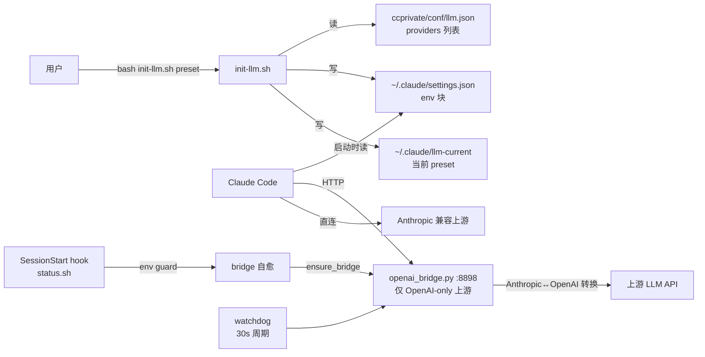

# init-llm — LLM 链路管理

> 目标：在多环境（单位/家里）、多 provider（直连+bridge）、多网络（VPN + tailscale via Windows）场景下，**稳定**切换 LLM，零配置成本。
>
> 面向用户和贡献者。回答"init-llm 是什么、为什么这样设计、坑在哪、怎么扩展"。

## 一、定位

`lib/init-llm.sh` 是 Claude Code 切换 LLM 的统一入口。它本质是 Claude Code 原生 `ANTHROPIC_BASE_URL` / `ANTHROPIC_MODEL` / `ANTHROPIC_AUTH_TOKEN` 的 bash 封装，加 OpenAI-only 端点的 Anthropic↔OpenAI 协议转换桥。



## 二、用户场景

| 场景 | 网络 | preset 类型 | 关键依赖 |
|------|------|------------|----------|
| 单位办公 | 直连内网，WSL + corp VPN | 直连 preset（Anthropic 兼容） | corp VPN |
| 家里 | WSL + Windows tailscale（**tailscaled 跑在 Windows 侧**）| bridge preset（含 `--use-win-curl`） | Windows tailscale + WSL mirrored 网络栈 |
| 应急/备用 | 任一 | minimax / deepseek_flash 直连 builtin | 无 |

**关键约束**：
- **稳定性 > 一切**：当前痛点是"探测 OK 但实际跑挂"（[见 §五](#五核心稳定性要求)）
- **家里只用 1 种模型**：合并 altllm*_tail 系列按需启用
- **单位 vs 家里是离散二元环境**：环境由人显式选（不搞自动探测，见 [ADR-0029](../docs/adr/0029-init-llm-target-2026.md) — 后续开 ADR）

## 三、能力清单

| 能力 | 子命令 / 菜单 | 状态 | 说明 |
|------|---------------|------|------|
| 切换 preset | `bash init-llm.sh <name>` | ✅ 保留 | 写 settings.json env 块 + llm-current |
| 状态诊断 | `bash init-llm.sh status` | ✅ 保留 | 链路 + bridge + gateway（未来删）状态 |
| 单点探测 | `bash init-llm.sh test <name>` | ✅ 保留 | 非破坏，curl POST + 看 HTTP code |
| 批量探测 | `bash init-llm.sh test all` | ✅ 保留 | 一键看所有 preset 可用性 |
| 增/改/删 preset | 菜单 `2A / 2B / 2C` | ✅ 保留 | 写 llm.json |
| 用量统计 | 菜单 `2E` | 🔧 改 | **新**：读 `ccprivate/usage/*.csv`，不再输入价格 |
| ~~Gateway 路由~~ | 菜单 `2D` | ❌ 删 | proxy.py 整套 2131 行 移除 |
| ~~token 价格输入~~ | `bash init-llm.sh bill` | ❌ 删 | 仅记用量，价格由上游账单算 |
| bridge 自愈 | `bash init-llm.sh heal` | ✅ 保留 | SessionStart hook + ensure_bridge |
| 修 `/model` 命令污染 | `bash init-llm.sh sync` | ✅ 保留 | 把顶层 `model` 同步到 `env.ANTHROPIC_MODEL` |

## 四、架构决策（基于 2026-09 调研）

### 调研覆盖

| 维度 | 调研范围 | 结论 |
|------|----------|------|
| **Anthropic↔OpenAI 转换** | OpenRouter / LiteLLM / Portkey / Bifrost / One-API / 社区代理 6 类 | 自研桥最贴合单 provider 场景 |
| **多 provider 管理** | Claude Code 原生 / OpenRouter / LiteLLM / Portkey / Cloudflare AI / Claude Apps Gateway | 当前架构已对齐官方推荐 |
| **WSL+VPN+tailscale 稳定性** | Tailscale Subnet Router / SSH tunnel / Cloudflare Tunnel / sshuttle / ngrok | bridge + win_curl 是最优解 |

### 核心决策

#### 决策 1：保留自研 bridge，不换 OpenRouter/LiteLLM

| 候选 | 评估 | 结论 |
|------|------|------|
| **OpenRouter** | 5.5% 平台费 + p50 延迟 +112ms + 8 个月 3 次宕机 | ❌ 单 provider 场景过设计 |
| **LiteLLM Proxy** | Anthropic 兼容最完整但 5 种生产故障模式 + Redis 依赖 | ❌ 部署成本高于自研桥 |
| **Portkey / Bifrost** | OpenAI 兼容输出，仍需 thin adapter 转 Anthropic SSE | ❌ 叠层复杂度 |
| **One-API** | 36K stars 但 Anthropic 协议 PR #2323 仍 open | ❌ 不完整 |
| **自研 openai_bridge.py** | 单一开发者维护，协议面可控，依赖仅 httpx + fastapi | ✅ 选 |

> 引用：调研报告 §2 各方案稳定性对比 + §3 真实案例。

#### 决策 2：bridge 与 win_curl 是不可替代的

| 候选 | WSL 网络栈隔离 | 探测/实际一致性 | 自愈 | 延迟开销 | 复杂度 |
|------|----------------|------------------|------|----------|--------|
| **bridge + win_curl（当前）** | ✅ 解决 | ✅ 已修（探测走真实流式链路）| 好（四层守护）| ~50ms | 低 |
| Tailscale Subnet Router | ❌ WSL 看不到路由表 | 好 | 好 | ~0.4s | 中 |
| Tailscale Serve HTTPS | ✅ 已废弃（ADR-0017 superseded by 0016） | — | — | — | — |
| Cloudflare Tunnel | ✅ 出站 | 好 | 好 | +80-200ms | 中 |
| SSH -L + systemd | ✅ | 好 | 差（断线不自愈）| ~30ms | 高 |
| sshuttle | ❌ 需 root + iptables | 中 | 中 | +50-100ms | 高 |

> WSL 网络栈隔离：WSL2 与 Windows 网络栈分离，VPN 分配的 IP 路由在 WSL 看不到（[microsoft/WSL#4517](https://github.com/microsoft/WSL/issues/4517)）；`curl.exe` 走 Windows 网络栈是当前唯一零依赖方案。

#### 决策 3：当前架构的可靠性模型（必落地）

详见 [§五 核心稳定性要求](#五核心稳定性要求)。

## 五、核心稳定性要求

**这是 init-llm 的首要设计目标**，由下面的多层守护 + 实现约束承担。

> ⚠️ **2026-09-17 修正**：本节原先描述的"3 个稳定性增强"（watchdog 大 body 探活、指数退避、SSE heartbeat）中，**前两项已被证明是负收益并全部移除**。它们用"探测失败就重启 bridge"的逻辑把网络抖动当成进程故障，反而杀掉正在服务的 bridge、打断进行中的请求 —— 这正是当时 office/home preset 全挂的直接原因之一。可靠性改由下面的分层模型承担。

### 5.1 四层守护模型（职责边界）

| 层 | 触发时机 | 职责 | 实现 |
|----|---------|------|------|
| `ensure_bridge` | 切换 preset 时 | 按目标上游起/重启 bridge，探 `/health` | `lib/ensure-bridge.sh` |
| `watchdog` | 运行时 | **只守护进程存活**：bridge 没了就按**当前** preset 拉起 | `lib/ensure-bridge.sh` |
| `status.sh` SessionStart | Claude 启动时 | 冷启动兜底（系统重启后 watchdog 也一起没了） | `lib/status.sh` |
| `selfheal_bridge` / `heal` | 手动 | 同上，可手动触发 | `lib/ensure-bridge.sh` |

**关键设计约束**：watchdog **不做 upstream 主动探测**。upstream 探测失败 ≠ bridge 故障；网络问题重启 bridge 修不了，只会杀掉正在服务的进程、打断请求。旧版正是这么把好的 bridge 换掉的。

**watchdog 必须跟随「当前」preset**：wrapper 若绑死启动时的 upstream/model/key，切 preset 后它会拿旧 upstream 覆盖用户刚选的 preset（在家切 tailscale 被打回单位地址）。现改为每次拉起都现场读 `llm-current` + `llm.json`（`lib/bridge-restart.sh`）。

### 5.2 SSE 心跳（防中间设备 idle 断流）

**根因**：upstream 不发 token 时（agent 等 tool call 30-60s）连接 0 字节流动，撞 tailscale 默认 75s idle / AWS ALB 60s idle / Cloudflare 100s idle 必断（[tianpan.co: SSE keepalive stripped](https://tianpan.co/blog/2026-06-03-the-sse-keepalive-your-reverse-proxy-stripped-between-provider-and-client)）。

**实现**：`openai_bridge.py` `_iter_with_idle_ping()`，每 15s 无 chunk 时注入 `: ping\n\n`（SSE 注释，Anthropic SDK 忽略）。

**实现约束（踩过大坑）**：**绝不能对 `anext()` 套 `asyncio.wait_for`**。超时 cancel 会弄死 async generator 丢数据；流正常结束时的 `StopAsyncIteration` 从 async generator 冒出还会被 CPython 转成 `RuntimeError`，掐断整条流。必须用 queue + 独立 pump task 实现。详见 memory `sse-async-gen-waitfor-pitfall-20260917`。

### 5.3 探测必须复现真实请求形态

`init-llm test` 曾有两个盲区，共同造成长期存在的"探测 OK 但实际挂"：

- **绕开 bridge 直接打 upstream**（当然通），完全没碰真正会挂的格式转换链路
- **用非流式请求**，流式链路的故障一个都暴露不出来

**现行判据**：走 bridge 的 preset 先 `ensure_bridge`、再经 bridge 发**流式**请求；判定 = 收到终止标记（`message_stop` / `[DONE]`）**且**响应无 `"type":"error"` **且** curl 退出码为 0（18 = 连接被掐断）。

**回归测试**：`tests/test-openai-bridge.sh`（用 mock upstream 造出正常/停顿/截断/空响应四种形态）。

### 5.4 额外坑：WSL2 MTU 1280 杀 tailscale 大包

**根因**：[tailscale/tailscale#4833](https://github.com/tailscale/tailscale/issues/4833) — WSL2 默认 MTU 1280，WireGuard overhead 让 1500-byte packet 被 silent drop。**理论上 tailscale 链路所有 HTTPS 请求都可能撞**。

**实现**：`ensure_bridge` 启动前用 `uname -r` 含 `microsoft` + `ip link show eth0` 判 MTU 1280 → warn。旧写法查 `/proc/sys/fs/ostype`，该文件在标准内核不存在，是**从未触发过的死代码**。

### 踩坑清单

1. **SSE heartbeat 不能污染 Anthropic SDK**：`: ping\n\n` 是 SSE 注释（RFC），SDK 忽略；若写 `event: ping` + `data: {}` 会触发 SDK 解析失败
2. **httpx 传入自定义 transport 时，`AsyncClient(verify=/limits=/trust_env=)` 会被静默忽略** —— 必须把这些参数交给 transport 本身，否则 `--skip-tls-verify` 形同虚设（曾长期未生效，靠域名匹配证书侥幸通过）
3. **`/health` 不要直接 `**state` 返回**：会把 upstream API key 明文吐给任何能访问该端口的人
4. **HTTP/2 下禁用 `Connection: keep-alive`**：bridge 必须检查 `extensions["http_version"]` 不输出该 header（[nestjs#17588](https://github.com/nestjs/nest/issues/17588)）
5. **Claude Code v2.1.117 之前 NO_PROXY 不生效**：[anthropics/claude-code#39862](https://github.com/anthropics/claude-code/issues/39862) — `init-llm.sh` 升级提示加 `claude --version` 检查

## 六、配置 schema

### `llm.json`（同步，ccprivate）

```json
{
  "llms": {
    "<preset_name>": {
      "name": "<display_name>",
      "base_url": "https://...",
      "model": "<model>",
      "small_model": "<model>",
      "key": "<api_key>",
      "use_bridge": true | false |缺失,
      "host_header": "<domain>"
    }
  }
}
```

字段语义：
- **`use_bridge` 三态**（[memory `use-bridge-absent-vs-false-20260907`](../memory/use-bridge-absent-vs-false-20260907.md)）：
  - `"True"` 显式强制走 bridge
  - `"False"` 显式禁 bridge（OpenAI-only + false → 早报错，不静默兜底）
  - **缺失** → OpenAI-only 端点自动起 bridge，Anthropic 端点直连
- **`host_header`** 可选（tailscale/SSH 透传场景证书 SAN 不匹配 IP 时，把 SNI + Host 改成证书里的真实域名/IP）

### `~/.claude/llm-current`（本地，不入 git）

存当前 preset key（ADR-0020）。每机独立，不参与 ccprivate 同步。

### `~/.claude/settings.json` env 块（本地）

Claude Code 唯一读取的 LLM 配置：

```json
{
  "env": {
    "ANTHROPIC_BASE_URL": "<base_url 或 http://127.0.0.1:8898>",
    "ANTHROPIC_MODEL": "<model>",
    "ANTHROPIC_DEFAULT_HAIKU_MODEL": "<small_model>",
    "ANTHROPIC_AUTH_TOKEN": "<key>",
    "CLAUDE_CODE_DISABLE_NONESSENTIAL_TRAFFIC": "1",
    "CLAUDE_CODE_ATTRIBUTION_HEADER": "0",
    "ENABLE_PROMPT_CACHING_1H": "1"
  }
}
```

`ANTHROPIC_BASE_URL` 指向 `http://127.0.0.1:8898` 时，bridge 自动拉起（SessionStart hook 自愈，ADR-0013）。

## 七、删减清单（2026-09 计划）

| 文件 / 段 | 行数 | 操作 | 原因 |
|-----------|------|------|------|
| `option-llmswitch/init.sh` | 798 | ❌ 删 | Gateway 启动管理（不再需要） |
| `option-llmswitch/proxy.py` | 439 | ❌ 删 | FastAPI 网关代理 |
| `option-llmswitch/watchdog.sh` | 108 | ❌ 删 | Gateway watchdog |
| `option-llmswitch/conf/llmswitch.json.example` | 17 | ❌ 删 | 模板 |
| `option-llmswitch/README.md` | 141 | ❌ 删 | 文档 |
| `option-llmswitch/__pycache__/` | — | ❌ 删 | 缓存 |
| `option-llmswitch/openai_bridge.py` | 628 | ✅ 保留 | Anthropic↔OpenAI 桥 |
| `lib/init-llm.sh` gateway 相关 | ~120 | ❌ 删 | `switch_to_gateway` / `stop_gateway` / `get_gateway_status` / `BUILTIN_PRESETS` 去 `gateway` |
| `lib/init-llm-bill.sh` 价格段 | ~140 | ❌ 删 | 改为"用量读取" |

总删除 ~1760 行（option-llmswitch 1531 + init-llm 120 + bill 140 = 1791）。

## 八、连接模型详解

### 1. 三类上游

| 类型 | 判定 | 行为 |
|------|------|------|
| **Anthropic 兼容** | base_url 含 `/anthropic` | 写 settings.json 直连，不起 bridge |
| **OpenAI-only** | base_url 不含 `/anthropic` 且非 `127.0.0.1` | 自动起 bridge（除非 use_bridge=false） |
| **本地 bridge** | base_url 是 `http://127.0.0.1:8898` | 已起 bridge，不重复拉起 |

### 2. use_bridge 决策表

| use_bridge 值 | Anthropic 兼容 | OpenAI-only |
|----------------|----------------|-------------|
| `"True"` | 报错（多余配置）| 强制走 bridge |
| `"False"` | 强制直连 | **早报错**（OpenAI-only + false = 不兼容 Claude Code）|
| **缺失** | 直连 | 自动起 bridge |

### 3. bridge 启动流程（ensure-bridge.sh）

```
ensure_bridge <upstream> <model> <key> <host_header>
├─ _bridge_supported 检查（upstream 非空、非 /anthropic、非本地）
├─ /health 端点探测
│   ├─ 已健康 + upstream 匹配 → start_bridge_watchdog → return 0
│   └─ 进程在但 upstream 不匹配 → 杀旧 + 重启
├─ 启动新 wrapper 脚本（解耦 bash 父子进程组，避免 SIGHUP 杀 python）
│   ├─ RFC1918/CGNAT 上游自动加 --use-win-curl
│   └─ https 上游加 --skip-tls-verify
├─ 等待 5s health 响应
├─ 删除 wrapper 文件（确保 python3 exec 已完成）
└─ start_bridge_watchdog（同 upstream 持续守护）
```

### 4. bridge watchdog 状态机

```
while true:
    /health = GET :8898/health
    ├─ 有响应 → fail=0 → sleep 10
    └─ 空响应（bridge 死）→ fail++ → bridge-restart.sh（按当前 preset）
                          → sleep min(5 × 2^(fail-1), 60)
```

`bridge-restart.sh` 每次现场读 `llm-current` + `llm.json` 取配置；当前 preset
不需要 bridge（直连 / `use_bridge:false`）时直接返回，不拉起。

> **不做 upstream 主动探测**：探测失败 ≠ bridge 故障，重启修不了网络问题，
> 反而会杀掉正在服务的进程、打断进行中的请求。旧版靠它"自愈"，实际把
> 用户刚切好的 preset 覆盖掉了。

## 九、不在本工具范围

- **LLM provider 协议适配**：只接受 Anthropic Messages 协议，OpenAI-only 必须经 bridge
- **多模型路由 / 负载均衡**：单 preset 单模型
- **用量计费 / 账单推送飞书**：[`option-usage/`](../../option-usage/) 独立模块负责
- **OpenAI↔Anthropic 双向转换**：openai_bridge.py 只做 Anthropic→OpenAI 方向（让 Claude Code 调 OpenAI-only LLM）

## 十、相关文档

- **设计依据 ADR**（按时间序）：
  - [ADR-0013 bridge 自愈 SessionStart hook](../adr/0013-bridge-selfheal-sessionstart.md)
  - [ADR-0015 废弃 altllm0731（停止自改 bridge 适配网关）](../adr/0015-llm-0731-deprecation.md)
  - [ADR-0016 Tailscale Subnet Router（WSL + Windows 自动触发 `--use-win-curl`）](../adr/0016-tailscale-subnet-router.md)
  - [ADR-0019 bridge 三层修复（WSL 网络栈 + DNS + ARG_MAX）](../adr/0019-bridge-win-curl-wsl-vpn.md)
  - [ADR-0020 settings.json LLM 本地化](../adr/0020-llm-current-local-per-machine.md)
  - 后续：ADR-0029 init-llm target（本文件落地的决策）
- **memory**（核心条目）：
  - [`llm-management`](../memory/llm-management.md)
  - [`altllm-split-presets-20260917`](../memory/altllm-split-presets-20260917.md)
  - [`use-bridge-absent-vs-false-20260907`](../memory/use-bridge-absent-vs-false-20260907.md)
  - [`claude-session-restart-after-llm-switch-20260917`](../memory/claude-session-restart-after-llm-switch-20260917.md)
  - [`init-llm-key-discard-on-verify-fail-20260902`](../memory/init-llm-key-discard-on-verify-fail-20260902.md)
  - [`openai-bridge`](../memory/openai-bridge.md)（含 0731 SSE bug 教训 + bridge 容错）

## 十一、未来工作

已完成（2026-09-17）：
- ~~删 §七 删减清单（gateway 整层，-1619 行）~~
- ~~init-llm-bill 简化为用量读取（按 model + day 聚合 CSV）~~
- ~~preset 合并（office-* / home-*）~~
- ~~ADR-0029 / ADR-0030 落地~~
- ~~§五 可靠性：四层守护模型 + 真实链路探测 + 回归测试~~

待办：
1. **合并 `verify_endpoint` 与 `test_llm`** —— 现存两个探测函数（114 行 / 64 行）行为不一致：`verify_endpoint` 对 bridge 只探 `/health`，`test_llm` 走完整流式。切换路径应复用同一套流式判据，否则"切换时探测不到位"的残余风险还在。
2. **评估 `switch_custom` / `edit_preset` 的必要性**（合计 ~130 行）—— 若实际都靠手改 `llm.json` + 菜单选，可移除。
3. **`show_status` 与 `status.sh` 的 LLM 段去重**。
4. **是否把 `tests/test-init-llm.sh` 重写为当前架构**（现标记过时，gateway 时代用例；bridge 部分已由 `test-openai-bridge.sh` 覆盖）。